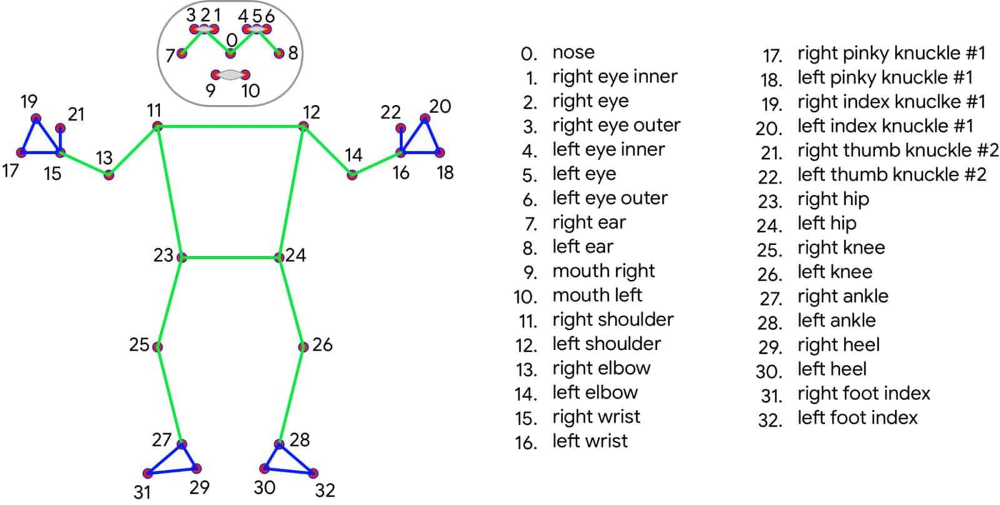

    
# Setup
```bash
git clone https://github.com/PyroBear5/PersonalAITrainer
cd PersonalAITrainer
python3 -m pip install -r requirements.txt
python3 surface.py
```
***Note: Mediapipe geht nur bis zu Python-Version 3.13 [Stand: 28.01.2025]***


# Verwendung

### 1. Übung auswählen
- Squat 
- Push-Up
- Plank
### 2. Übung durchführen
- Während der Übung auf den Bildschirm achten, es wird korrekte Durchführung kontrolliert, ein Counter eingebunden und ggf. auch ein Highscore eingeblendet.
## Mediapipe

Mediapipe ist eine Open-Source-Bibliothek von Google, die Werkzeuge für die Implementierung von Multimedia- und maschinellem Lernen-Pipelines bereitstellt, welche essenziell sind für dieses Projekt. Sie wird häufig für die Echtzeit-Verarbeitung von Videostreams verwendet, um Aufgaben wie Gesichtserkennung, Handtracking und Körperpose-Tracking zu ermöglichen. Durch vorgefertigte Lösungen und optimierte Performance unterstützt Mediapipe Entwickler bei der schnellen Umsetzung komplexer Computer Vision-Anwendungen.

### Anwendung Mediapipe

Mediapipe wird in diesem Projekt verwendet um ein Skelett des Menschen vor der Kamera zu bekommen. Aus diesem Skelett kann man dann die nötigen Punkte entnehmen, welche für die Berechnung wichtig sind. (Siehe Abbildunggen)



# Code  


---
## ***surface.py:***


### 1. **Importe und Setup**

```python
import cv2
import mediapipe as mp
import time
import customtkinter as ctk
from tkinter import messagebox
```

Dies importiert die notwendigen Bibliotheken wie **OpenCV** (für Bildverarbeitung), **Mediapipe** (für Pose-Schätzung), **time** (für Zeitmessung) und **Tkinter** (für die GUI).

---

### 2. **Pose-Detection und Landmarken**

```python
mp_pose = mp.solutions.pose
pose = mp_pose.Pose(min_detection_confidence=0.5, min_tracking_confidence=0.5)
```

Hier wird der Mediapipe-Pose-Estimator initialisiert. Die Parameter **min_detection_confidence** und **min_tracking_confidence** bestimmen, wie sicher Mediapipe eine Pose erkennen muss, bevor sie verwendet wird.

---

### 3. **Übungserkennung für Squats**

```python
def detect_squat(landmarks):
    global squat_counter, prev_squat_position, down_check_squat

    # Berechne Winkel zwischen Hüfte, Knie und Sprunggelenk
    # Definiere hier die Logik, die die Pose bewertet
    angle_knee = calculate_angle(landmarks[23], landmarks[25], landmarks[27])  # Beispiel für Kniewinkel
    angle_hip = calculate_angle(landmarks[23], landmarks[11], landmarks[12])  # Beispiel für Hüftwinkel

    if prev_squat_position == "Down" and angle_knee > 160:
        prev_squat_position = "Up"
        down_check_squat = True

    if prev_squat_position == "Up" and angle_knee < 90 and down_check_squat:
        prev_squat_position = "Down"
        squat_counter += 1
        down_check_squat = False
```

**Erklärung:**

- Diese Funktion erkennt, ob der Nutzer korrekt in die Hocke geht und zählt den **Squat** basierend auf dem Winkel zwischen den Gelenken.
- Wenn der **Kniewinkel** einen bestimmten Wert überschreitet (z.B. unter 90 Grad), wird ein Squat gezählt.

---

### 4. **Übungserkennung für Push-ups**

```python
def detect_pushup(landmarks):
    global pushup_counter, prev_position, down_check

    # Berechne Winkel im Ellbogen
    angle_elbow = calculate_angle(landmarks[11], landmarks[13], landmarks[15])  # Beispiel für Ellbogenwinkel

    if prev_position == "Up" and angle_elbow < 90:
        prev_position = "Down"
        down_check = True

    if prev_position == "Down" and angle_elbow > 160 and down_check:
        prev_position = "Up"
        pushup_counter += 1
        down_check = False
```

**Erklärung:**

- Diese Funktion zählt **Push-ups** basierend auf dem Winkel des Ellbogens. Wenn der Winkel unter einem bestimmten Wert fällt, wird der Push-up als "abgeschlossen" gezählt.

---

### 5. **Plank-Erkennung**

```python
def detect_plank(landmarks):
    global timer_start, stable_duration

    # Überprüfe die Körperhaltung auf eine gerade Linie
    is_body_straight = check_body_alignment(landmarks)
    is_head_aligned = check_head_alignment(landmarks)
    is_elbow_under_shoulder = check_elbow_alignment(landmarks)

    if is_body_straight and is_head_aligned and is_elbow_under_shoulder:
        if timer_start is None:
            timer_start = time.time()  # Timer starten
        else:
            stable_duration = time.time() - timer_start  # Zeit berechnen
```

**Erklärung:**

- Hier wird überprüft, ob der Körper des Nutzers eine gerade Linie bildet (z.B. beim **Plank**). Wenn der Körper korrekt ausgerichtet ist, wird die Zeit gemessen, wie lange der Nutzer die Position hält.

---

### 6. **Webcam-Stream und Übungserkennung starten**

```python
def start_exercise_detection():
    exercise_choice = selected_exercise.get()  # Ausgewählte Übung von der GUI
    if not exercise_choice:
        messagebox.showerror("Error", "Please select an exercise.")
        return

    cap = cv2.VideoCapture(0)
    while cap.isOpened():
        ret, frame = cap.read()
        if not ret:
            break
        # Mediapipe Pose-Detection anwenden
        results = pose.process(frame)
        if results.pose_landmarks:
            landmarks = results.pose_landmarks.landmark
            if exercise_choice == "Squat":
                detect_squat(landmarks)
            elif exercise_choice == "Push-up":
                detect_pushup(landmarks)
            elif exercise_choice == "Plank":
                detect_plank(landmarks)
        # Zeige Bild an
        cv2.imshow("Exercise Detection", frame)
        if cv2.waitKey(1) & 0xFF == ord('q'):
            break
    cap.release()
    cv2.destroyAllWindows()
```

**Erklärung:**

- Diese Funktion startet den **Webcam-Stream** und überwacht fortlaufend die Position des Nutzers.
- Basierend auf der Übungsauswahl des Nutzers wird entweder **Squat**, **Push-up** oder **Plank** erkannt und verarbeitet.

---

### 7. **GUI mit Tkinter**

```python
root = ctk.CTk()

# Erstelle Buttons für Übungsauswahl
squat_button = ctk.CTkButton(root, text="Squat", command=lambda: start_selected_exercise("Squat"))
pushup_button = ctk.CTkButton(root, text="Push-up", command=lambda: start_selected_exercise("Push-up"))
plank_button = ctk.CTkButton(root, text="Plank", command=lambda: start_selected_exercise("Plank"))

# Buttons anordnen
squat_button.grid(row=0, column=0)
pushup_button.grid(row=1, column=0)
plank_button.grid(row=2, column=0)

root.mainloop()
```

**Erklärung:**

- Hier wird die GUI mit **Tkinter** erstellt. Es gibt Buttons für jede Übung (Squat, Push-up, Plank), die die entsprechende Übungserkennung starten, wenn sie gedrückt werden.

---

### Zusammenfassung des Codes:

- **Pose-Schätzung:** Mediapipe wird verwendet, um die Landmarken des Körpers zu extrahieren.
- **Übungserkennung:** Es gibt separate Funktionen für **Squats**, **Push-ups** und **Planks**, die die Winkel der Gelenke überprüfen und Übungen zählen.
- **Webcam-Stream:** Ein fortlaufender Webcam-Stream wird verwendet, um die Übungen in Echtzeit zu überwachen und zu zählen.
- **GUI:** Eine einfache Tkinter-Oberfläche ermöglicht es dem Benutzer, zwischen den Übungen zu wählen und die Erkennung zu starten.

Das Programm kombiniert diese Elemente zu einer funktionsfähigen Übungserkennungsanwendung

## ***Surface.py gesamt:
```python
import cv2
import mediapipe as mp
from tkinter import messagebox
import tools.calculateAngle
import time
import customtkinter as ctk
from tkinter import messagebox

  

#for plank

timer_start = None

stable_duration = 0

stable_duration_highscore = 0

  

#for pushuppushup_counter = 0

prev_position = None

down_check = False

  

#for squat

squat_counter = 0

prev_squat_position = None

down_check_squat = False

  

# Mediapipe Pose Initialisierung

mp_pose = mp.solutions.pose

pose = mp_pose.Pose()

mp_drawing = mp.solutions.drawing_utils

  

def detect_squat(landmarks, image):

    global squat_counter, prev_squat_position, down_check_squat

  

    # Relevante Keypoints abrufen (y und z)

    left_hip = [landmarks[mp_pose.PoseLandmark.LEFT_HIP.value].y, landmarks[mp_pose.PoseLandmark.LEFT_HIP.value].x]

    left_knee = [landmarks[mp_pose.PoseLandmark.LEFT_KNEE.value].y, landmarks[mp_pose.PoseLandmark.LEFT_KNEE.value].x]

    left_ankle = [landmarks[mp_pose.PoseLandmark.LEFT_ANKLE.value].y, landmarks[mp_pose.PoseLandmark.LEFT_ANKLE.value].x]

    left_shoulder = [landmarks[mp_pose.PoseLandmark.LEFT_SHOULDER.value].y, landmarks[mp_pose.PoseLandmark.LEFT_SHOULDER.value].x]

  

    # Prüfe, ob alle Punkte mit mindestens 80% Wahrscheinlichkeit erkannt wurden

    if (landmarks[mp_pose.PoseLandmark.LEFT_HIP.value].visibility >= 0.8 and

        landmarks[mp_pose.PoseLandmark.LEFT_KNEE.value].visibility >= 0.8 and

        landmarks[mp_pose.PoseLandmark.LEFT_ANKLE.value].visibility >= 0.8 and

        landmarks[mp_pose.PoseLandmark.LEFT_SHOULDER.value].visibility >= 0.8):

        # Knie-Hüfte-Sprunggelenk-Winkel berechnen (y, z)

        angle_knee = tools.calculateAngle.calculate_angle(left_hip, left_knee, left_ankle)

  

        # Schulter-Hüfte-Winkel berechnen (zurückgelehnter Oberkörper, y, z)

        angle_torso = tools.calculateAngle.calculate_angle(left_shoulder, left_hip, left_knee)

  

        # Haltung bestimmen

        if angle_knee > 160 and angle_torso > 150:

            position = "Up"

        elif angle_knee < 90 and angle_torso < 130:

            position = "Down"

        else:

            position = "Intermediate"

  

         # Squat counter logic (similar to push-up counter)

        if prev_squat_position != position:  # Check if the position has changed

            if prev_squat_position == "Up" and position == "Intermediate":

                prev_squat_position = position

            elif prev_squat_position == "Intermediate" and position == "Down":

                prev_squat_position = position

                down_check_squat = True

            elif prev_squat_position == "Down" and position == "Intermediate":

                prev_squat_position = position

            elif prev_squat_position == "Intermediate" and position == "Up" and down_check_squat == True:

                squat_counter += 1

                down_check_squat = False

                prev_squat_position = position

            else: #Handles cases where the pose estimation "jumps" e.g from up to down directly

                prev_squat_position = position

  

        # Text auf das Bild schreiben

        cv2.putText(image, f'Squat Position: {position}', (50, 50), cv2.FONT_HERSHEY_SIMPLEX, 1, (0, 0, 0), 8, cv2.LINE_AA)

        cv2.putText(image, f'Squat Position: {position}', (50, 50), cv2.FONT_HERSHEY_SIMPLEX, 1, (255, 255, 255), 2, cv2.LINE_AA)

  

        #cv2.putText(image, f'Knee Angle: {int(angle_knee)}', (50, 100), cv2.FONT_HERSHEY_SIMPLEX, 1, (255, 0, 0), 2, cv2.LINE_AA)

        #cv2.putText(image, f'Torso Angle: {int(angle_torso)}', (50, 150), cv2.FONT_HERSHEY_SIMPLEX, 1, (255, 0, 0), 2, cv2.LINE_AA)

        cv2.putText(image, f'Squats: {squat_counter}', (50, 450), cv2.FONT_HERSHEY_SIMPLEX, 1, (0, 0, 0), 8, cv2.LINE_AA)

        cv2.putText(image, f'Squats: {squat_counter}', (50, 450), cv2.FONT_HERSHEY_SIMPLEX, 1, (0, 255, 0), 2, cv2.LINE_AA)

  
  
  

    else:

        cv2.putText(image, 'Body not fully visible!', (50, 50), cv2.FONT_HERSHEY_SIMPLEX, 1, (0, 0, 0), 8, cv2.LINE_AA)

        cv2.putText(image, 'Body not fully visible!', (50, 50), cv2.FONT_HERSHEY_SIMPLEX, 1, (0, 250, 0), 2, cv2.LINE_AA)

  
  

def detect_pushup(landmarks, image):

    global pushup_counter, prev_position, down_check

  

    # Push-up Erkennung

    left_shoulder = [landmarks[mp_pose.PoseLandmark.LEFT_SHOULDER.value].x, landmarks[mp_pose.PoseLandmark.LEFT_SHOULDER.value].y]

    left_elbow = [landmarks[mp_pose.PoseLandmark.LEFT_ELBOW.value].x, landmarks[mp_pose.PoseLandmark.LEFT_ELBOW.value].y]

    left_wrist = [landmarks[mp_pose.PoseLandmark.LEFT_WRIST.value].x, landmarks[mp_pose.PoseLandmark.LEFT_WRIST.value].y]

    left_hip = [landmarks[mp_pose.PoseLandmark.LEFT_HIP.value].x, landmarks[mp_pose.PoseLandmark.LEFT_HIP.value].y]

    left_ankle = [landmarks[mp_pose.PoseLandmark.LEFT_ANKLE.value].x, landmarks[mp_pose.PoseLandmark.LEFT_ANKLE.value].y]

  

    # Prüfe, ob alle Punkte mit mindestens 80% Wahrscheinlichkeit erkannt wurden

    if (landmarks[mp_pose.PoseLandmark.LEFT_SHOULDER.value].visibility >= 0.8 and

        landmarks[mp_pose.PoseLandmark.LEFT_ELBOW.value].visibility >= 0.8 and

        landmarks[mp_pose.PoseLandmark.LEFT_WRIST.value].visibility >= 0.8 and

        landmarks[mp_pose.PoseLandmark.LEFT_HIP.value].visibility >= 0.8 and

        landmarks[mp_pose.PoseLandmark.LEFT_ANKLE.value].visibility >= 0.8):

  

        # Berechnung der Ausrichtung (Alignment)

        angle_shoulder_hip_ankle = tools.calculateAngle.calculate_angle(left_shoulder, left_hip, left_ankle)

        if abs(angle_shoulder_hip_ankle - 180) < 10:

            alignment = "Aligned"

        else:

            alignment = "Not Aligned"

  

        # Berechnung der Push-up Position

        angle = tools.calculateAngle.calculate_angle(left_shoulder, left_elbow, left_wrist)

        if angle < 80:

            position = "Down"

        elif angle > 150:

            position = "Up"

        else:

            position = "Intermediate"

  

        # Logik für den Push-up-Zähler

        if alignment == "Aligned":

            if prev_position == "Intermediate" and position == "Down":

                prev_position = position

                down_check = True

            elif prev_position == "Intermediate" and position == "Up" and down_check == True:

                pushup_counter += 1  # Zähler erhöhen

                prev_position = position

                down_check = False

            else:

                prev_position = position

        else:

            prev_position = None  # Sequenz zurücksetzen, wenn nicht aligned


  

        # Text auf das Bild schreiben

        cv2.putText(image, f'Push-up Position: {position}', (50, 50), cv2.FONT_HERSHEY_SIMPLEX, 1, (0, 0, 0), 8, cv2.LINE_AA)

        cv2.putText(image, f'Push-up Position: {position}', (50, 50), cv2.FONT_HERSHEY_SIMPLEX, 1, (255, 255, 255), 2, cv2.LINE_AA)

        #cv2.putText(image, f'Angle: {int(angle)}', (50, 100), cv2.FONT_HERSHEY_SIMPLEX, 1, (255, 0, 0), 2, cv2.LINE_AA)

        cv2.putText(image, f'Alignment: {alignment}', (50, 100), cv2.FONT_HERSHEY_SIMPLEX, 1, (0, 0, 0), 8, cv2.LINE_AA)

        cv2.putText(image, f'Alignment: {alignment}', (50, 100), cv2.FONT_HERSHEY_SIMPLEX, 1, (255, 255, 0), 2, cv2.LINE_AA)

        #cv2.putText(image, f'Shoulder-Hip-Ankle Angle: {int(angle_shoulder_hip_ankle)}', (50, 200), cv2.FONT_HERSHEY_SIMPLEX, 1, (255, 0, 0), 2, cv2.LINE_AA)

        cv2.putText(image, f'Push-ups: {pushup_counter}', (50, 450), cv2.FONT_HERSHEY_SIMPLEX, 1, (0, 0, 0), 8, cv2.LINE_AA)

        cv2.putText(image, f'Push-ups: {pushup_counter}', (50, 450), cv2.FONT_HERSHEY_SIMPLEX, 1, (0, 255, 0), 2, cv2.LINE_AA)

    else:

        cv2.putText(image, f'Body not fully visible!', (50, 50), cv2.FONT_HERSHEY_SIMPLEX, 1, (0, 0, 0), 8, cv2.LINE_AA)

        cv2.putText(image, f'Body not fully visible!', (50, 50), cv2.FONT_HERSHEY_SIMPLEX, 1, (0, 250, 0), 2, cv2.LINE_AA)

  
  

# Funktion für Plank-Erkennung

def detect_plank(landmarks, image):

    global timer_start, stable_duration, stable_duration_highscore

    shoulder = landmarks[mp_pose.PoseLandmark.LEFT_SHOULDER.value]

    hip = landmarks[mp_pose.PoseLandmark.LEFT_HIP.value]

    knee = landmarks[mp_pose.PoseLandmark.LEFT_KNEE.value]

    head = landmarks[mp_pose.PoseLandmark.NOSE.value]

    elbow = landmarks[mp_pose.PoseLandmark.LEFT_ELBOW.value]

  

    if (landmarks[mp_pose.PoseLandmark.LEFT_SHOULDER.value].visibility >= 0.8 and

        landmarks[mp_pose.PoseLandmark.LEFT_ELBOW.value].visibility >= 0.8 and

        landmarks[mp_pose.PoseLandmark.LEFT_WRIST.value].visibility >= 0.8 and

        landmarks[mp_pose.PoseLandmark.LEFT_HIP.value].visibility >= 0.8 and

        landmarks[mp_pose.PoseLandmark.LEFT_ANKLE.value].visibility >= 0.8):

        is_body_straight = abs(shoulder.y - hip.y) < 0.1 and abs(hip.y - knee.y) < 0.1

        is_head_aligned = abs(head.y - shoulder.y) < 0.1

        is_elbow_under_shoulder = abs(shoulder.x - elbow.x) < 0.05

        is_correct = shoulder.y - elbow.y < 0

  
  

        if is_body_straight and is_head_aligned and is_elbow_under_shoulder and is_correct:

            if timer_start is None:

                timer_start = time.time()  # Timer starten

            else:

                stable_duration = time.time() - timer_start  # Dauer berechnen

                if stable_duration >= stable_duration_highscore:

                    stable_duration_highscore = stable_duration

            stability = "Stable"

        else:

            timer_start = None  # Timer zurücksetzen

            stable_duration = 0

            stability = "Unstable"

  

        cv2.putText(image, f'Plank Stability: {stability}', (50, 50), cv2.FONT_HERSHEY_SIMPLEX, 1, (0, 0, 0), 8, cv2.LINE_AA)

        cv2.putText(image, f'Plank Stability: {stability}', (50, 50), cv2.FONT_HERSHEY_SIMPLEX, 1, (255, 0, 0), 2, cv2.LINE_AA)

  

        cv2.putText(image, f'Time Stable: {stable_duration:.1f}s', (0, 450), cv2.FONT_HERSHEY_SIMPLEX, 1, (0, 0, 0), 8, cv2.LINE_AA)

        cv2.putText(image, f'Time Stable: {stable_duration:.1f}s', (0, 450), cv2.FONT_HERSHEY_SIMPLEX, 1, (0, 255, 0), 2, cv2.LINE_AA)

  

        cv2.putText(image, f'Highscore: {stable_duration_highscore:.1f}s', (0, 400), cv2.FONT_HERSHEY_SIMPLEX, 1, (0, 0, 0), 8, cv2.LINE_AA)

        cv2.putText(image, f'Highscore: {stable_duration_highscore:.1f}s', (0, 400), cv2.FONT_HERSHEY_SIMPLEX, 1, (0, 255, 0), 2, cv2.LINE_AA)

  

        if not is_body_straight:

            cv2.putText(image, 'Align Body', (50, 100), cv2.FONT_HERSHEY_SIMPLEX, 0.8, (0, 0, 0), 6, cv2.LINE_AA)

            cv2.putText(image, 'Align Body', (50, 100), cv2.FONT_HERSHEY_SIMPLEX, 0.8, (0, 0, 255), 2, cv2.LINE_AA)

  

        if not is_head_aligned:

            cv2.putText(image, 'Align Head', (50, 150), cv2.FONT_HERSHEY_SIMPLEX, 0.8, (0, 0, 0), 6, cv2.LINE_AA)

            cv2.putText(image, 'Align Head', (50, 150), cv2.FONT_HERSHEY_SIMPLEX, 0.8, (0, 0, 255), 2, cv2.LINE_AA)

  

        if not is_elbow_under_shoulder:

            cv2.putText(image, 'Adjust Elbow Position', (50, 200), cv2.FONT_HERSHEY_SIMPLEX, 0.8, (0, 0, 0), 6, cv2.LINE_AA)

            cv2.putText(image, 'Adjust Elbow Position', (50, 200), cv2.FONT_HERSHEY_SIMPLEX, 0.8, (0, 0, 255), 2, cv2.LINE_AA)

    else:

        cv2.putText(image, f'Body not fully visible!', (50, 50), cv2.FONT_HERSHEY_SIMPLEX, 1, (0, 0, 0), 8, cv2.LINE_AA)

        cv2.putText(image, f'Body not fully visible!', (50, 50), cv2.FONT_HERSHEY_SIMPLEX, 1, (0, 250, 0), 2, cv2.LINE_AA)

  
  

# Webcam starten und Übungserkennung durchführen

def start_exercise_detection():

    exercise_choice = selected_exercise.get()

    if not exercise_choice:

        messagebox.showerror("Error", "Please select an exercise.")

        return

  

    cap = cv2.VideoCapture(0)

    # Erlaubt das Fenster zu resizen

    cv2.namedWindow(f'{exercise_choice} Detection', cv2.WINDOW_NORMAL)

  

    while cap.isOpened():

        ret, frame = cap.read()

        if not ret:

            break

  

        image = cv2.cvtColor(frame, cv2.COLOR_BGR2RGB)

        image.flags.writeable = False

        results = pose.process(image)

        image.flags.writeable = True

        image = cv2.cvtColor(image, cv2.COLOR_RGB2BGR)

  

        if results.pose_landmarks:

            mp_drawing.draw_landmarks(image, results.pose_landmarks, mp_pose.POSE_CONNECTIONS)

            landmarks = results.pose_landmarks.landmark

  

            if exercise_choice == "Squat":

                detect_squat(landmarks, image)

            elif exercise_choice == "Push-up":

                detect_pushup(landmarks, image)

            elif exercise_choice == "Plank":

                detect_plank(landmarks, image)

        else:

            cv2.putText(image, 'No Pose Detected', (50, 50), cv2.FONT_HERSHEY_SIMPLEX, 1, (0, 0, 255), 2, cv2.LINE_AA)

  

        # Resizable Fenster anzeigen

        cv2.imshow(f'{exercise_choice} Detection', image)

        if cv2.waitKey(10) & 0xFF == ord('q'):

            break

  

    cap.release()

    cv2.destroyAllWindows()

  

# Tkinter setup

root = ctk.CTk()

root.geometry("500x500")  # Resizeable window

root.title("Exercise Detection")

  

# Configure grid layout to make widgets resizable

root.grid_columnconfigure(0, weight=1)  # Ensure the column is resizable

root.grid_rowconfigure(0, weight=1)     # Row for the title

root.grid_rowconfigure(1, weight=1)     # Row for the first button

root.grid_rowconfigure(2, weight=1)     # Row for the second button

root.grid_rowconfigure(3, weight=1)     # Row for the third button

root.grid_rowconfigure(4, weight=1)     # Row for the start button

  

# Title Label

title_label = ctk.CTkLabel(root, text="Choose an Exercise", font=("Arial", 40))

title_label.grid(row=0, column=0, padx=10, pady=10, sticky="nsew")

  

# Exercise Buttons

selected_exercise = ctk.StringVar()

  

def start_selected_exercise(exercise):

    selected_exercise.set(exercise)

    start_exercise_detection()

  

# Buttons for Exercise Choices

squat_button = ctk.CTkButton(root, text="Squat", command=lambda: start_selected_exercise("Squat"), font=("Arial", 24))

squat_button.grid(row=1, column=0, padx=10, pady=5, sticky="nsew")

  

pushup_button = ctk.CTkButton(root, text="Push-up", command=lambda: start_selected_exercise("Push-up"), font=("Arial", 24))

pushup_button.grid(row=2, column=0, padx=10, pady=5, sticky="nsew")

  

plank_button = ctk.CTkButton(root, text="Plank", command=lambda: start_selected_exercise("Plank"), font=("Arial", 24))

plank_button.grid(row=3, column=0, padx=10, pady=5, sticky="nsew")

  
  

root.mainloop()
```
---
### ***calculateAngle.py***

### **Berechnung des Winkels zwischen drei Punkten**

```python
import numpy as np

def calculate_angle(a, b, c):
    # Wandelt die Eingabepunkte (a, b, c) in NumPy Arrays um, um vektorbasierte Berechnungen durchzuführen
    a = np.array(a)
    b = np.array(b)
    c = np.array(c)

    # Berechnet den Winkel zwischen den Vektoren (b -> a) und (b -> c) mit der arctan2-Funktion
    radians = np.arctan2(c[1] - b[1], c[0] - b[0]) - np.arctan2(a[1] - b[1], a[0] - b[0])
    
    # Wandelt den Winkel von Bogenmaß in Grad um
    angle = np.abs(radians * 180.0 / np.pi)

    # Wenn der Winkel größer als 180 Grad ist, wird er auf den kleineren Winkel zwischen 0 und 180 Grad angepasst
    if angle > 180.0:
        angle = 360 - angle

    return angle
```

### **Erklärung der einzelnen Schritte:**

1. **Vektor-Transformation**
    
    ```python
    a = np.array(a)
    b = np.array(b)
    c = np.array(c)
    ```
    
    - Hier werden die Eingabepunkte `a`, `b` und `c` in **NumPy Arrays** umgewandelt, da NumPy eine effiziente Berechnung von Vektoren ermöglicht.
2. **Berechnung der Winkel in Bogenmaß**
    
    ```python
    radians = np.arctan2(c[1] - b[1], c[0] - b[0]) - np.arctan2(a[1] - b[1], a[0] - b[0])
    ```
    
    - Die **arctan2-Funktion** berechnet den Winkel zwischen der X-Achse und dem Vektor, der durch zwei Punkte definiert ist. In diesem Fall wird der Winkel zwischen den Vektoren `b -> a` und `b -> c` berechnet.
    - Die Berechnung erfolgt durch die Subtraktion der beiden Winkel, um den Winkel zwischen den beiden Vektoren zu erhalten.
3. **Umwandlung von Bogenmaß in Grad**
    
    ```python
    angle = np.abs(radians * 180.0 / np.pi)
    ```
    
    - Der Winkel, der in **Bogenmaß** berechnet wurde, wird hier in **Grad** umgewandelt, da wir in der Regel mit Grad arbeiten.
4. **Anpassung des Winkels auf den kleineren Wert (0 bis 180 Grad)**
    
    ```python
    if angle > 180.0:
        angle = 360 - angle
    ```
    
    - Da der größte mögliche Winkel zwischen zwei Vektoren 180 Grad beträgt, wird der Winkel angepasst, falls er mehr als 180 Grad beträgt, um den kleineren Winkel zu erhalten.
5. **Rückgabe des berechneten Winkels**
    
    ```python
    return angle
    ```
    
    - Der berechnete Winkel wird zurückgegeben.

---

